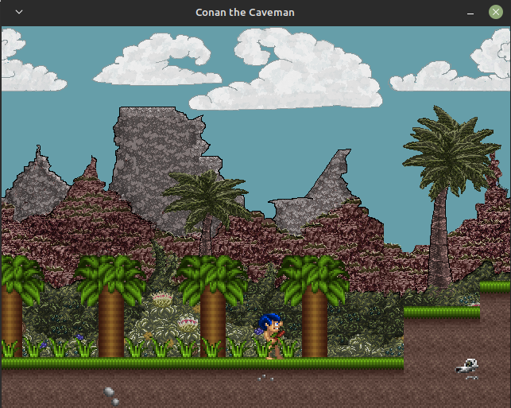

# Conan-the-Caveman-Linux

Example project from ['SDL Game Development'][2] by Shaun Mitchell. The book explains everything from a Windows user perspective.



## Getting Started

To get SDL2 working under an Ubuntu-based system (i.e., Linux Mint, Windows Subsystem for Linux, etc.), please see this [script to build the extensions][1] or `sudo apt install libsdl2-dev libsdl2-gfx-dev libsdl2-image-dev libsdl2-mixer-dev libsdl2-ttf-dev` will do.  Then, install the following:

```bash
sudo apt install libtinyxml-dev tiled  -y #for the .tmx files, Tiled Map Editor
```

[1]: https://gist.github.com/WillSams/e2bb2874ace22b90f90f
[2]: https://www.packtpub.com/game-development/sdl-game-development
